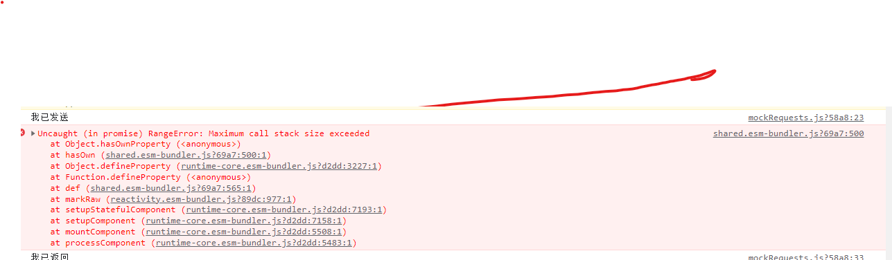
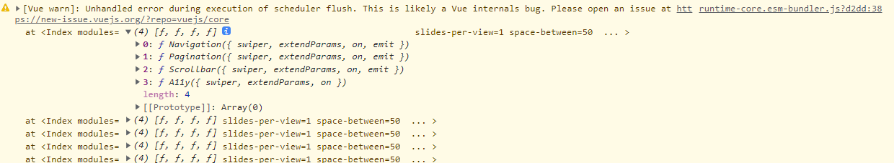

###webpack.config.js文件隐藏下，如何配置，在vue-config.js配置插件时报错未解决
使用configureWebpack：{}，直接书写plugins时会出现错误
如

vue-config.js具体代码
  configureWebpack:{

    plugins:[
      AutoImport({
        resolvers:[ElementPlusResolver()]
      }),
      Components({
        resolvers:[ElementPlusResolver()]
      })
    ]

  }

